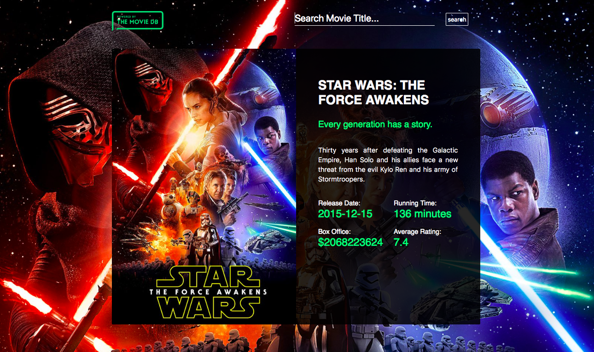

# Movie Search

Movie Search is a React app loading data via The Movie Database API. The user entering the title of the movie receives its description and additional information such as release date, running time or average rating.

## Technologies used in this project:

- ReactJS
- JavaScript (ES6 standard)
- SASS
- Bootstrap
- Webpack

## Preview

